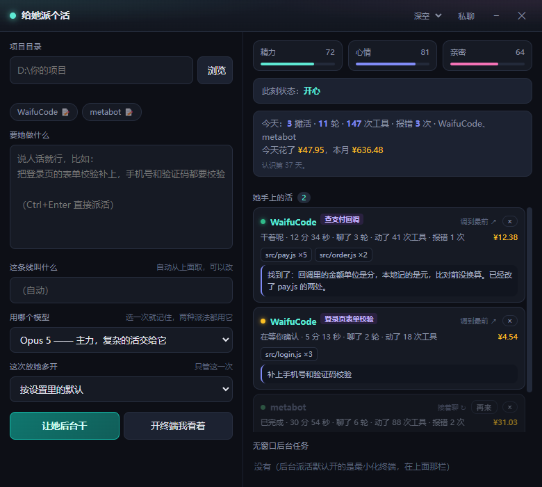
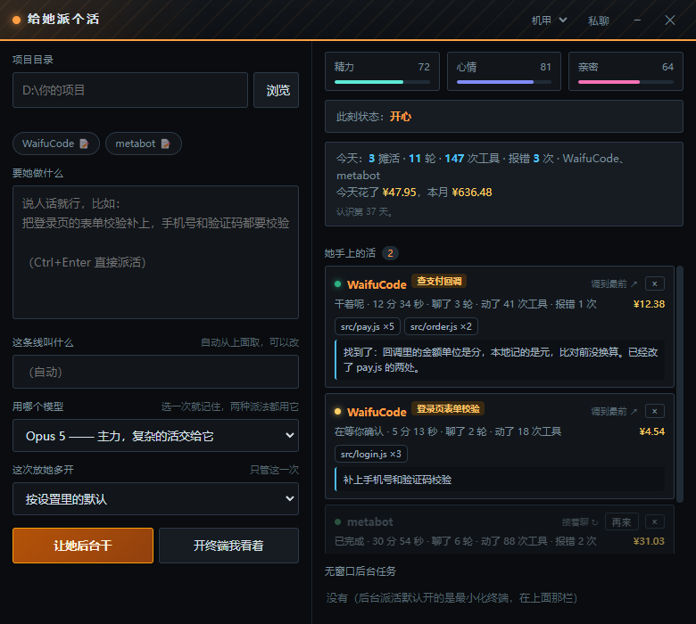
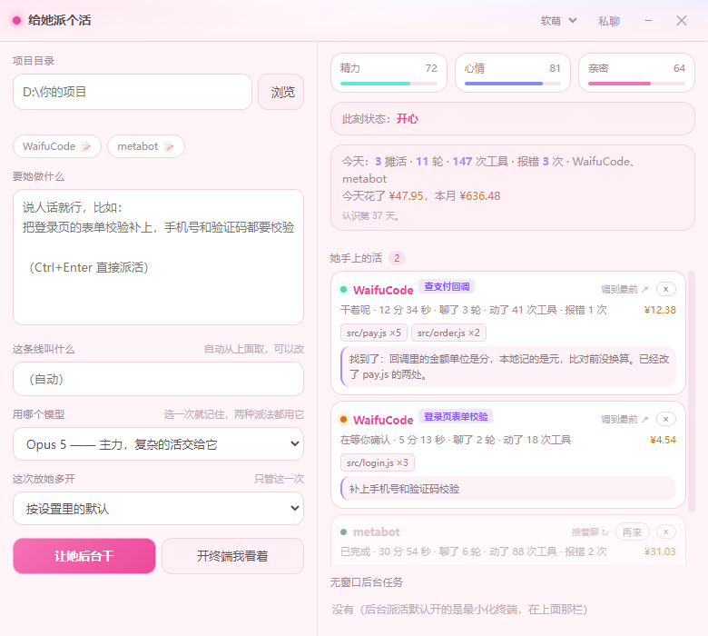
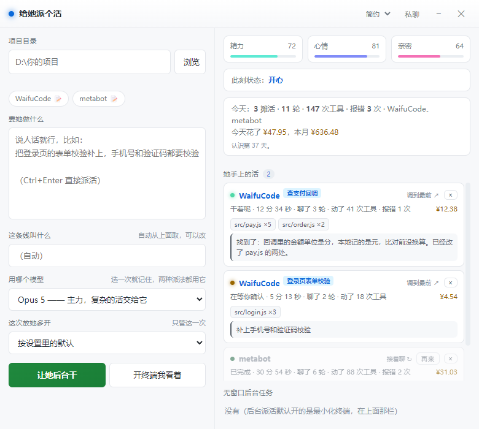
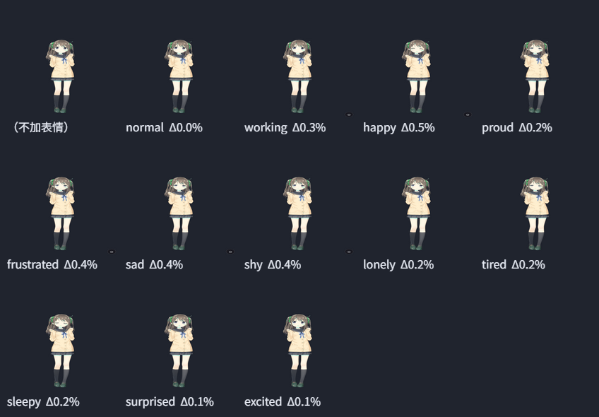

<div align="center">


# WaifuCode

**住在桌面角落的 Live2D 看板娘 × Claude Code —— 她真的能帮你写代码**

派活给她、看她干活、跟她聊天；累了肩膀会塌，一遍过会得意，晾久了会闹脾气。


</div>

---

## 她能干什么

| | 说明 | 花钱吗 |
|---|---|---|
| 🛠 **真的干活** | 双击她打开派活面板，说句人话她就调 Claude Code 开工——后台最小化干，或开终端你看着。同一个项目能同时开好几条线，各问各的互不串 | 按 Claude 用量 |
| 👀 **全程可见** | 干活时她微微前倾；连着报错会绷紧、压低头；卡住会歪头；**等你确认时转过来正对着你**（这时点她一下直接跳到那个终端）。面板上能看到她改了哪些文件、每条线烧了多少钱 | 不花 |
| 🎭 **有表情有情绪** | 精力 / 心情 / 亲密度是真实数值：一遍过干完会得意四分钟，活砸了垂头丧气，半夜会催你睡。13 个角色全部会变脸 | 不花 |
| 🕺 **唱跳玩** | 跳舞是按 BPM 现算的编舞（不是循环播动作）、放你自己丢进 `music/` 的歌、猜情绪 / 猜歌 / 番茄钟小游戏 | 不花 |
| 💬 **私聊** | 独立会话、手上没工具（不会顺手改你代码），聊完回头戳她，她记得刚才聊了什么 | 约 ¥0.06/轮 |
| 🎨 **换装换人** | 摘帽子脱外套（Mao）、整套换配色贴图（海梦 ×3、Hiyori、猫）、AI 花纹重画布料 | 不花 |

> 「她怎么动」全部本地计算不花钱；只有「她说什么」和「替你写代码」走 Claude。
> 每一分钱面板上都对得上账——读的是 Claude Code 自己的会话记录，按官方单价折算。

## 长什么样

派活面板四套皮肤，右上角随手换：

| 深空（默认） | 机甲 |
|---|---|
|  |  |

| 软萌 | 简约 |
|---|---|
|  |  |

模型没自带表情的，工具会照着它真实的脸部参数生成一套（12 种情绪）：



## 快速开始

```bash
git clone https://github.com/bryan-bao/WaifuCode.git
cd WaifuCode
npm install
npm start
```

- 需要 **Windows** + **Node.js 18+**；「派活 / 私聊」需要装好 [Claude Code](https://claude.com/claude-code)（`npm i -g @anthropic-ai/claude-code`），没装的话唱跳、摸头、小游戏、换装照样能玩
- 打包安装版：`npm run dist`（产物在 `dist/`）

## 文档

| 文档 | 给谁看 |
|---|---|
| [玩法说明](玩法说明.md) | **给用户**：她会什么、怎么玩、哪些花钱 |
| [开发手册](docs/开发手册.md) | **给改代码的**：架构、实现、踩过的每一个坑 |

## 声明

- 角色模型来自 [Live2D 官方免费样例](https://www.live2d.com/en/learn/sample/)（按其许可仅用于学习交流）及使用者自备模型
- 不含任何从音乐平台下载 / 抓取音频的功能，只播放你自己放进 `music/` 的文件
- 会话记录、聊天内容、配置全部只存在你本机
